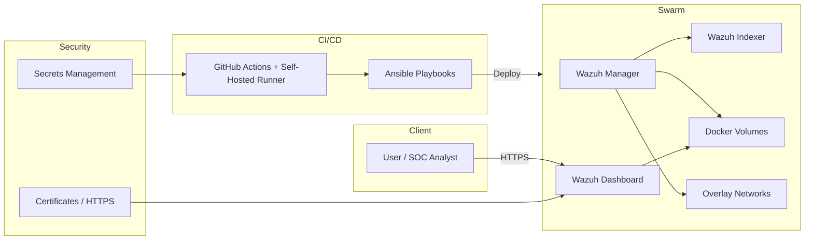
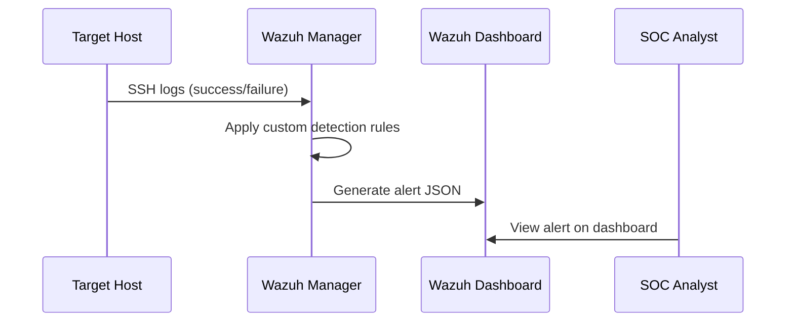

# High-Level Design (HLD) – Mini SOC Platform

## Overview
This document describes the high-level design for the Mini SOC (Security Operations Center) platform using Wazuh SIEM, container orchestration, and DevOps practices. The design emphasizes automation, security, and reproducibility.

- **Purpose:** To provide a fully automated SOC environment capable of detecting suspicious activities, including brute-force SSH attempts followed by unusual logins.
- **Scope:** Deployment of Wazuh stack on Docker Swarm, CI/CD pipelines, custom detection rules, secure secrets handling, HTTPS dashboard exposure, automated testing, and optional HA and DR setups.
- **Key Non-Functional Requirements:** 
  - Security: Enforce least-privilege, encrypt secrets, HTTPS access.
  - Availability: Optional multi-node Swarm HA.
  - Reproducibility: Fully automated deployment via CI/CD and Ansible.
  - Observability: Monitoring, logging, and alerting.

## Architecture Summary
Major components and interactions:
- **Frontend:** Wazuh Dashboard (UI), accessed via HTTPS
- **Backend:** Wazuh Manager, Indexer
- **Storage:** Docker volumes for persistence
- **CI/CD:** GitHub Actions with self-hosted runners
- **Security:** Secrets management (GitHub Actions Secrets, Swarm secrets, Ansible Vault)
- **Detection & Rules:** Custom Wazuh rules for SSH brute-force detection
- **Optional Enhancements:** Geo-IP enrichment, Slack/Teams alerting, SOAR playbooks

## Component Diagram

## Deployment Topology
- **Environment:** `dev`, `staging`, `prod`
- **Containerization:** Docker + Docker Swarm
- **Networking:** Overlay networks for inter-service communication
- **Certificates:** Automated HTTPS via Traefik/Let’s Encrypt
- **CI/CD Workflow:**
  - Build images
  - Scan images with Trivy (fail on Critical/High)
  - Selenium tests for dashboard and API
  - Deploy via Ansible to Swarm
- **Rollback & Idempotency:** Ensure safe deployments and stack updates

## Data Flow (High Level)
1. Developer pushes code/PR to GitHub.
2. GitHub Actions triggers pipeline on PR or push to main.
3. Container images are built and scanned with Trivy.
4. Selenium and API tests run.
5. Ansible deploys stack to Swarm if tests pass.
6. Users access Wazuh Dashboard over HTTPS.
7. Wazuh Manager processes logs, custom rules detect threats.
8. Alerts stored in Indexer and visible in Dashboard.

## Technology Choices & Rationale
- **Wazuh:** Open-source SIEM, log analysis, alerting
- **Docker Swarm:** Lightweight orchestration, supports multi-node HA
- **GitHub Actions:** CI/CD automation with optional self-hosted runners
- **Ansible:** Idempotent deployment automation
- **Trivy:** Image security scanning
- **Selenium:** End-to-end UI testing
- **Traefik / Nginx:** HTTPS with automated certificates

## Security & Secrets
- No secrets in Git or YAML
- Secrets stored in GitHub Actions Secrets, Swarm secrets, or Ansible Vault
- Rotation policy documented
- TLS enforced for all dashboard access

## High-Level Alerting Flow

## Next Steps
- Implement CI/CD workflow in `.github/workflows`
- Configure Docker Swarm stack with Wazuh services
- Write Ansible playbooks for deployment
- Develop custom Wazuh detection rules (SSH brute-force)
- Test Selenium and API probes
- Document HA/DR considerations if implemented
- Capture screenshots for evidence of pipeline success and alerts

*Generated HLD tailored for SOC Architect Technical Challenge with Wazuh, Docker Swarm, CI/CD, security, and alerting.*

